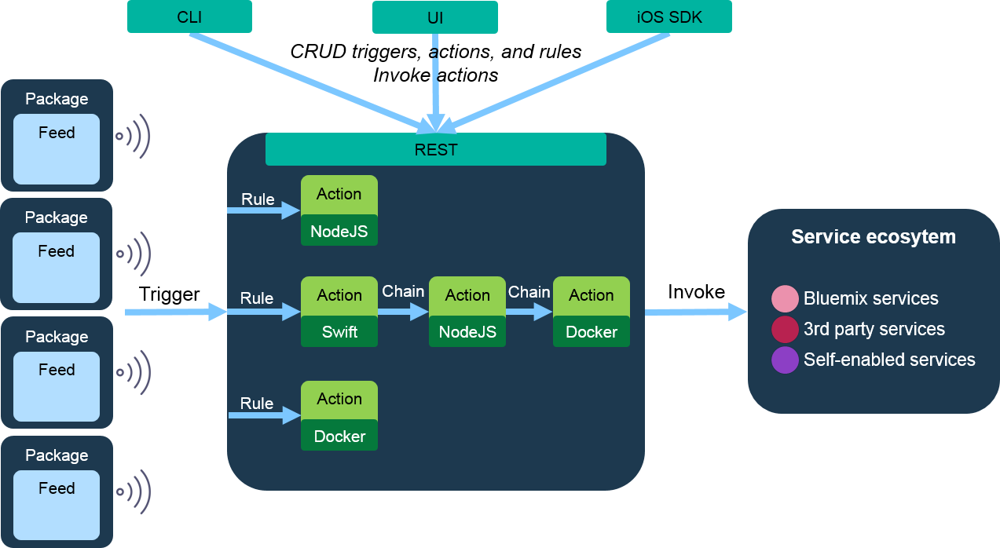

# openwhisk



## Description
Easily call OpenWhisk REST microservies.


## Install
```sh
$ npm install openwhisk --save
```


## Usage
```js
var OpenWhisk = require('openwhisk');

// blocking mode
OpenWhisk('org_name', 'space_name', 'action_name', 'key', payload)
.then(function(){
  console.log('The results of the invocation are now available.');
});

// non-blocking
OpenWhisk('org_name', 'space_name', 'action_name', 'key', payload, false)
.then(function(){
  console.log('The activation id is now available.');
});
```


## License
MIT © [Chyld Medford](https://github.com/chyld)
